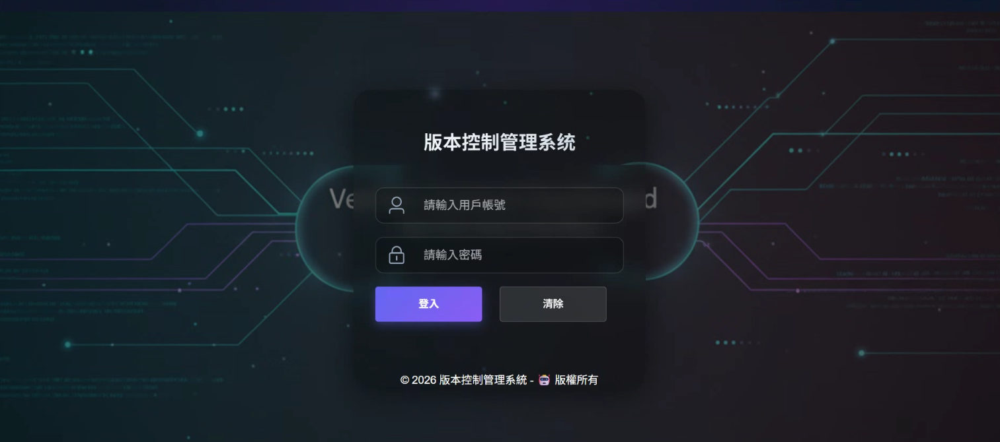
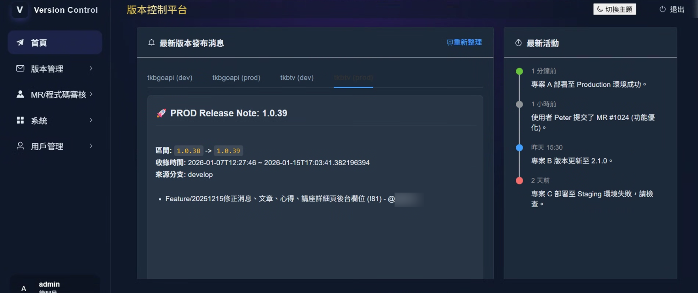
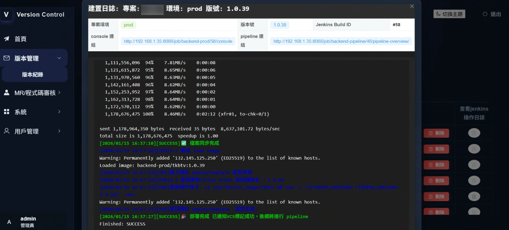
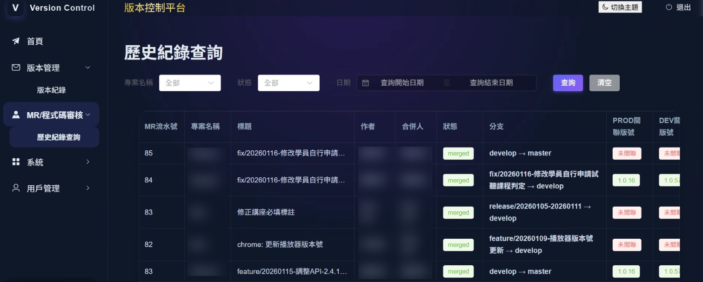
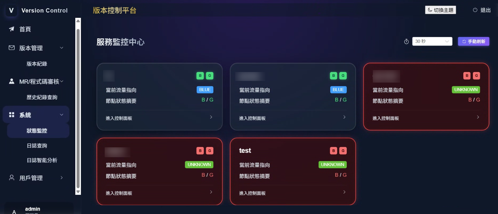
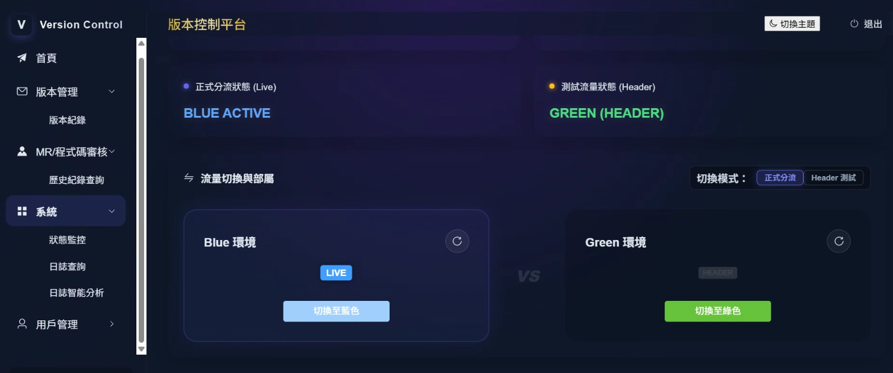
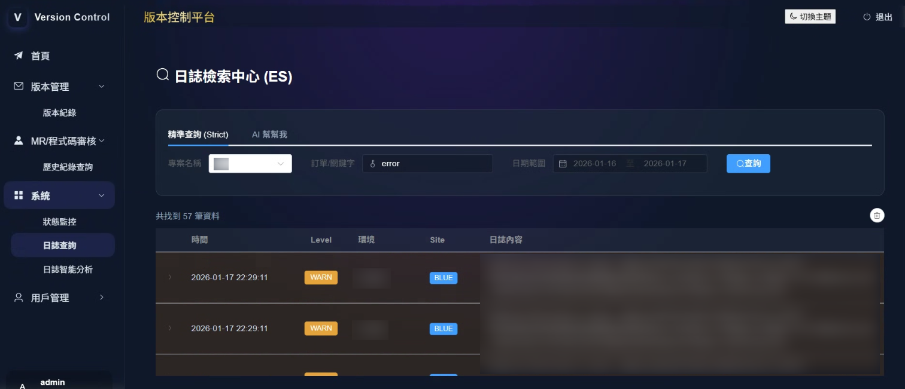
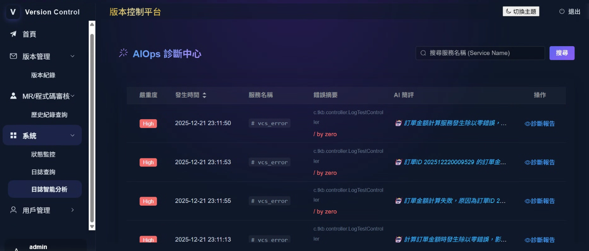
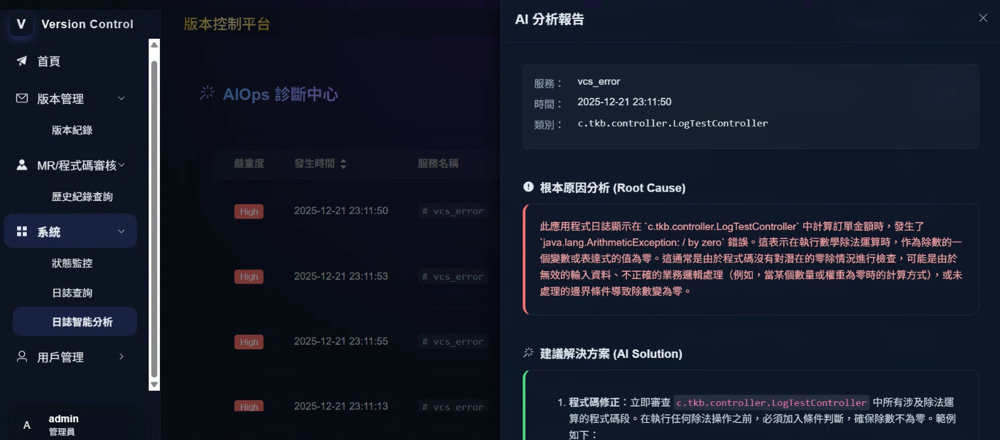

# 🚀 版本控制後台管理中心 (VCS Ops Center)
    一體化 DevOps 維運與 AI 智能診斷平台

    整合版本控制、CI/CD 狀態追蹤、系統流量控制與 AI 日誌分析，為開發與維運團隊提供全方位的監控視角。

## 📖 專案介紹 (Introduction)
在微服務與持續整合的開發環境中，版本追蹤與即時故障排查往往耗費大量人力。「版本控制後台管理中心」解決這一個問題，打造一個開發維運一體化 (DevOps) 的管理入口。

本專案不僅僅是一個版本紀錄工具，更整合了 Gitlab 與 Jenkins，實現從代碼提交到部署的可視化追蹤。此外，系統創引入 Google Gemini AI 模型，針對 Elasticsearch 蒐集的系統日誌進行智能分析，自動產出診斷報告，大幅縮短問題定位時間 (MTTR)。配合即時的健康檢查與流量切換功能，確保系統的高可用性。

## ✨ 核心功能特色
- 版本全生命週期管理：紀錄專案版號，並與 Gitlab Commit ID 深度關聯，追溯歷史變更。

- 自動化部署監控：整合 Jenkins CI/CD 狀態，即時掌握部署進度。

- 系統高可用治理：提供服務健康檢查儀表板，並支援一鍵式服務流量切換與 Nginx 整合。

- AI 智能運維 (AIOps)：
    - ES 日誌檢索：快速查詢 Elasticsearch 中的海量日誌。
    - AI 診斷：利用 Gemini AI 分析異常日誌，自動生成人類可讀的錯誤原因與修復建議報告。

##  🛠️ 技術棧 (Tech Stack)
本專案採用前後端分離架構，後端基於 Spring Boot 3 生態系，前端採用 Vue 3 現代化開發流程。

**Backend (後端服務)**
| 類別   | 技術/工具  | 說明   |
| :-------------- | ------------------| :---------------------------------- |
| Framework       | Spring Boot 3     | 核心框架，提供快速開發能力            |
|                 | Spring MVC        | RESTful API 構建                    | 
| Security        | JWT (jjwt)        | 無狀態身份驗證與授權                  |
| Database        | MySQL 8.0         | 關聯式資料庫，儲存核心業務數據         |
|                 | MyBatis Plus      | ORM 框架，簡化 SQL 操作              |
|                 | PageHelper        | 資料庫分頁插件                       |
| Search & Log    | Elasticsearch     | 分散式日誌存儲與全文檢索              |
| API Doc         | Knife4j (Swagger) | 增強版 API 文檔與調試工具 (OpenAPI 3) |
| Network & Ops   | Nginx             | 反向代理與流量負載均衡  |
|                 | Bash Script       | 伺服器自動化腳本  |
| CI/CD & Tools   | Gradle            | 專案建置與依賴管理  |
| CI/CD & Tools   | Git / Gitlab      | 版本控制與 API 整合  |
| CI/CD & Tools   | Jenkins           | 自動化部署流水線整合  |
| AI & Automation | Gemini AI         | 串接 Google Generative AI 進行日誌分析  |
| AI & Automation | n8n               | 工作流自動化工具  |

---
## Frontend (前端介面)
**Frontend (前端介面)**
| 類別            | 技術/工具           | 說明                                |
| :-------------- | ------------------ | :---------------------------------- |
| Core            | Vue 3              | JavaScript 框架 (Composition API)    |
| Build Tool      | Vite               | 前端構建工具                          | 
| UI Library      | Element Plus       | UI 組件庫                             |
| Styling         | TailwindCSS        | 原子化 CSS 框架 (PostCSS)             |
| HTTP Client     | Axios              | 處理 API 請求                         |
| Markdown        | Markdown-it        | 渲染 AI 產出的診斷報告                 |

## 📂 專案結構 (Project Structure)

```bash
vcs/
├── infa/             # Infrastructure 層：存放資料庫 SQL DDL、初始化腳本
├── tkb/              # Backend 層：Java Spring Boot 專案源碼
│   ├── src/main/java
│   └── build.gradle
└── web/              # Frontend 層：Vue 3 前端專案源碼
    ├── src/
    ├── package.json
    └── vite.config.ts
```

## 🚀 快速開始 (Getting Started)

1. 環境準備
- JDK 17+
- Node.js 16+
- MySQL 8.0+
- Elasticsearch (用於日誌服務)

2. 資料庫初始化
進入 infa 目錄，執行 SQL 腳本以建立資料庫表結構。

3. 後端啟動 (Backend)
    
    進入 tkb 目錄：
    ```bash
    # 下載依賴並編譯
    ./gradlew clean build

    # 啟動服務
    ./gradlew bootRun
    ```
    後端預設端口：8080 (請依 application.yml 設定為準) API 文件地址：http://localhost:8080/doc.html (Knife4j)

4. 前端啟動 (Frontend)
    
    進入 web 目錄：
    ```bash
    # 安裝依賴
    npm install

    # 開發模式啟動
    npm run dev
    ```

## 系統功能預覽

**登入頁面**


**首頁**					        



**專案部屬**					        


**Jenkins CICD 部屬**					        

					
**Gitlab 歷史紀錄**					        


**系統監控**					        


**服務流量切換**					        


**ES 日誌快速檢所**					        


**AI 日誌**					        


**AI 日誌診斷報告**					        



   